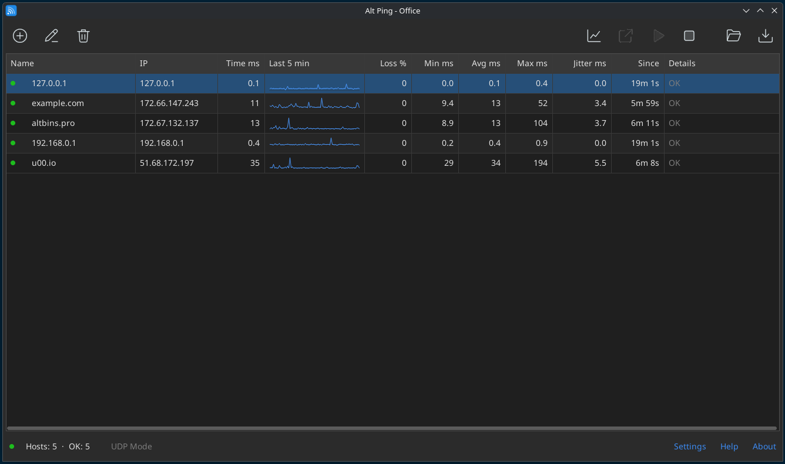

# AltPing

A desktop monitor for host availability. Add hosts to a list and AltPing
pings them all at once. For each host it shows the response time, packet
loss and a trend line, and it keeps a day of history. It runs on Linux,
Windows and macOS as a single binary, and on Linux and macOS it works
without root rights.

Website and documentation: https://altbins.pro/altping/



## Features

- **Checks.** ICMP ping over IPv4 and IPv6, or a TCP connect to a port.
  The interval, timeout and "slow" threshold are set per host.
- **Statistics.** Loss, min/avg/max and jitter over the last 5 minutes,
  plus how long a host has been in its current state. Click a column
  header to sort by it.
- **History.** The last 24 hours are saved to disk, so they are still
  there after a restart. The chart shows 5 minutes, 1 hour or 24 hours
  for up to 4 hosts at once. The outage list shows when each host was
  down, and the history can be exported to CSV.
- **Alerts.** A host can be set to beep when it goes down or comes back.
  The taskbar button then flashes, and the window title shows how many
  hosts are down.
- **Public page.** One click sends a host's ping times to a public page
  with a live chart on [u00.io](https://u00.io).
- **Host lists.** Keep several lists, for example "Office" and "Servers",
  and change settings for many hosts at once.
- **Interface.** System tray, always on top, keyboard shortcuts, light
  and dark themes, 13 languages.
- **One copy at a time.** Starting AltPing again brings the running window
  to the front, even from the tray.

## Installation

Download a build for your system from the
[releases](https://github.com/ipoluianov/altping/releases):

- **Windows:** `altping-windows-*.exe`. When started, it offers to install
  itself into `%USERPROFILE%\.altbins`. Remove it from "Installed apps".
- **macOS:** the `.dmg` image.
- **Linux:** a `.deb` or `.rpm` package, or a user-level install (no root)
  with:

  ```sh
  curl -fsSL https://github.com/ipoluianov/altping/releases/latest/download/linux-x64-install.sh | bash
  ```

Settings, host lists and history are stored in `~/.altbins/.altping/`.

## Building

You need Go (see the version in [go.mod](go.mod)). No cgo is required.

```sh
go build .
```

`build/all.sh` (or `build/all.bat`) builds every platform into `bin/`,
together with the deb/rpm packages, the dmg and the installer script.

## License

[MIT](LICENSE) © Ivan Poluianov
